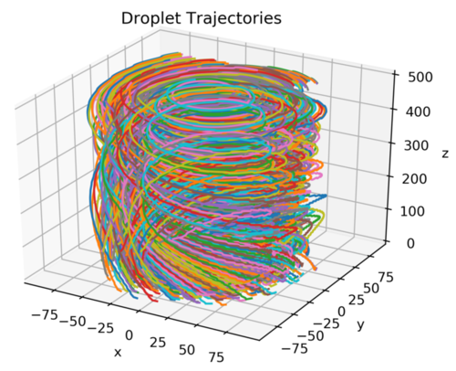
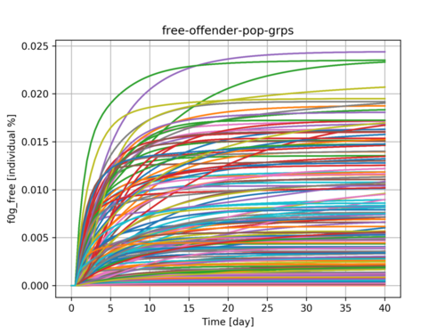

# Cortix on Jupyter Notebooks

| Network dynamics modeling & simulation | on | Jupyter |
|:---:|:--:|:----:|
|  | <==> |  |

This repo is home to a set of  Jupyter notebooks that contain  examples of the usage of [Cortix](https://github.com/dpploy/cortix). 

Clone the repo to run the notebooks locally, or use [Binder](https://mybinder.org/v2/gh/dpploy/cortix-nb/master) or [Azure](https://notebooks.azure.com/dealmeidavf/projects/cortix-nb) to run them in your browser.

Static versions of the notebooks are available on [NBViewer](http://nbviewer.jupyter.org/github/dpploy/cortix-nb).

# Examples

|  | Topic |
|:---|:---|
| | [Droplets Swirl in a Vortex](https://nbviewer.jupyter.org/github/dpploy/cortix-nb/blob/master/run_droplet_swirl.ipynb) -  Simulates the motion of a swarm of droplets in a vortex stream |
| | [City Justice](https://nbviewer.jupyter.org/github/dpploy/cortix-nb/blob/master/run_city_justice.ipynb) - Simulates a population dynamics model across the network of a hypothetical criminal justice system. |

*  [Droplets Swirl in a Vortex](https://nbviewer.jupyter.org/github/dpploy/cortix-nb/blob/master/run_droplet_swirl.ipynb) -  Simulates the motion of a swarm of droplets in a vortex stream.

*  [City Justice](https://nbviewer.jupyter.org/github/dpploy/cortix-nb/blob/master/run_city_justice.ipynb) - Simulates a population dynamics model across the network of a hypothetical criminal justice system.

